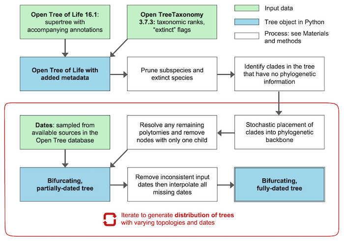

# Assembling fully-dated complete trees of life

This Python workflow contains code that takes the Open Tree of Life, resolves all polytomies, assigns dates from available chronograms in the Open Tree database, and interpolates missing dates to produce fully-dated bifurcating trees. For a full explanation of the algorithms and the results of using them, see [this preprint](https://doi.org/10.64898/2026.03.05.709771).

## 1. Workflow example

A step-by-step example of the workflow on a small example tree of 64 species is available in the Python notebook [Worked_example.ipynb](https://github.com/dated-complete-tree/blob/main/Worked_example.ipynb). This requires the Python packages `ete4` and `numpy`, but no further data downloads outside this repository are required to work through the notebook.

The notebook is also available in [pdf form](https://github.com/jdduke24/dated-complete-tree/blob/main/Worked_example.pdf) or as a plain [Python text file](https://github.com/jdduke24/dated-complete-tree/blob/main/Worked_example.py).

## 2. Date interpolation only

The algorithms for interpolating missing dates on a tree can be used independently of this workflow and independently of Open Tree, via a command-line Python script requiring only the `ete4` and `numpy` Python packages. The script `interpolate_newick.py` takes a text file with a Newick tree and a text file with a list of node ages, interpolates missing dates, and writes out a Newick tree with branch lengths. Leaf nodes with no date are assumed to have a date of 0. The root node must be dated.

By default the script looks for a tree file called `phylo` and a tab-separated file of nodes and ages called `ages` (in this respect it behaves the same as the software `phylocom bladj`). The input files can instead be specified; for example `interpolate_newick.py --phylo=examples/Columbiformes.tre --ages=examples/Columbiformes_ages.txt`. See `interpolate_newick.py --help` for further options.

## 3. Working with the dataset rather than generating it

Pre-computed median trees of 2.3 million species and the accompanying tree distributions can be found [at the accompanying Zenodo dataset](https://doi.org/10.5281/zenodo.19049120).

If you want a fully-dated tree but require only a subtree or subset of species, see the Python notebook [getting_a_subtree.ipynb](https://github.com/jdduke24/dated-complete-tree/blob/main/getting_a_subtree.ipynb).

## 4. The full workflow for generating trees

Starting with the Open Tree of Life, polytomy resolution and date interpolation can be performed repeatedly to generate distributions of fully-dated complete trees. Dates are assigned from the available chronograms in the [Open Tree phylesystem](github.com/OpenTreeOfLife/phylesystem-1); where there are multiple dates available for a node, a date can be sampled at random or a median date can be used. Optionally, you can also compute a distribution of evolutionary distinctiveness scores for each leaf node (you can choose ED/EDGE or ED2/EDGE2).

### Prerequisites:

- The Open Tree of Life. We require the tree in Newick form, available at … By default we look for a folder `./opentree16.1_tree/` containing the files `annotations.json` and `labelled_supertree/labelled_supertree_ottnames.tre`.

- The Open Tree Taxonomy. We require the tab-separated taxonomy file, available at … By default we look for a folder called `./ott3.7.3/` containing `taxonomy.tsv`.

- The dates that will be assigned to the tree. We have included a cache of the dates we used to generate our dataset, in the file `chronosynth_date_info/node_ages.json`. This was generated on 19 February 2026. These dates come from chronograms in the Open Tree phylesystem database of trees, which anyone can contribute to. To update the cache with the latest available data, you require the Python package chronosynth, available at https://github.com/OpenTreeOfLife/chronosynth/. Then run `tree_loading.load_metadata(force_dates_refresh=True)`.

- The Python packages `ete4` and `numpy`.

### Usage:

There are three options:

1. The file `main.py` can be run from the command line. For available options run:
`python main.py --help`.
For example:
 `python main.py --num_trees=10 --pd_clades=pd_clades.txt`
will produce 10 trees with different topologies and a text file with phylogenetic diversity (PD) distributions for the clades specified in your text file `./pd_clades.txt` (one Open Tree node name per line, e.g. Eukaryota_ott304358). The default output folder for the Newick-format trees and the PD file is `./output/`.

2. The file `main_non_exec.py` contains code you can edit and run from your favourite Python IDE.

3. A Jupyter notebook `edge2_notebook.ipynb` is included, which will open a Jupyter (IPython) notebook to step through the process of loading trees and computes EDGE2 scores.

### Reproducing the pre-computed tree distributions

Should you wish to reproduce the distributions of trees used in the paper, use the following commands:

- equal_splits_topo.tar.gz: `python main.py --num_trees=501 --pd_clades=pd_clades.txt`

- equal_splits_both.tar.gz: `python main.py --num_trees=501 --num_date_samples=3 --pd_clades=pd_clades.txt`

- birth_model_topo.tar.gz: `python main.py --use_birth_model --num_trees=101 --pd_clades=pd_clades.txt`

- birth_model_both.tar.gz: `python main.py --use_birth_model --num_trees=101 --num_date_samples=3 --pd_clades=pd_clades.txt`